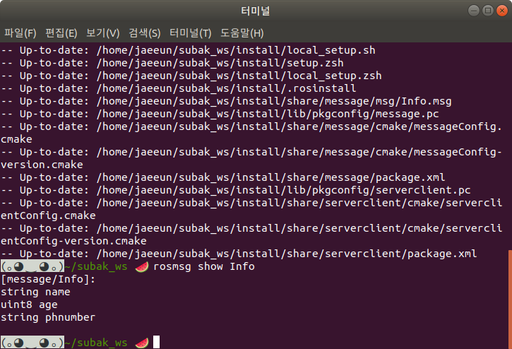

# message 만들기 

## 사전준비
- worksapce 만들기
```
> mkdir -p ~/subak_ws/src
> cd ~/subak_ws/src
> catkin_init_workspace
> cd ~/subak_ws
> catkin_make
> source ~/subak_ws/devel/setup.bash
```
- message package 만들기
```
> cd ~/subak_ws/src
> catkin_create_pkg message rospy roscpp std_msgs
```


## msg 파일 생성
```
> cd ~/subak_ws/src/message
> mkdir msg
> cd ~/subak_ws/src/message/msg
> code ./Info.msg
```

## package.xml 수정
```
> cd ~/subak_ws/src/message
> code ./package.xml
```
- message 생성을 위한 dependency 추가 
<build_depend>message_generation</build_depend>
<exec_depend>message_runtime</exec_depend>


## CMakeLists.txt 수정
 
  ``` 
  > cd ~/subak_ws/src/message
  > code ./CMakeLists.txt
 
  find_package(catkin REQUIRED COMPONENTS
   ...
   message_generation //추가
   )

catkin_package(
  ...
  CATKIN_DEPENDS message_runtime ... //추가
  )

add_message_files(
  FILES
  Info.msg
)
  ``` 

## message 빌드하기
```
> cd ~/subak_ws
> catkin_make install
```

## message 확인
```
> rosmsg show Info
> rosmsg info Info
```

